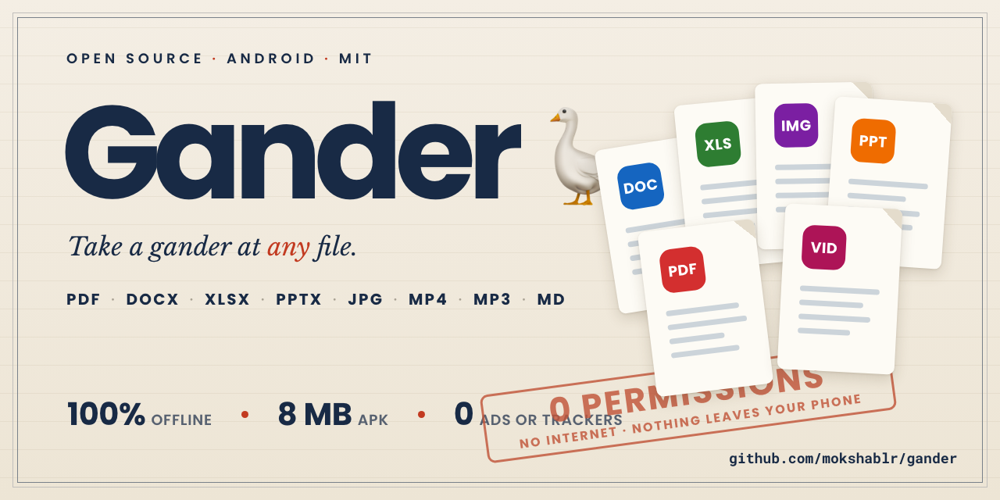
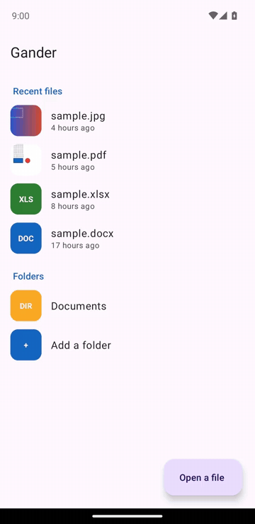
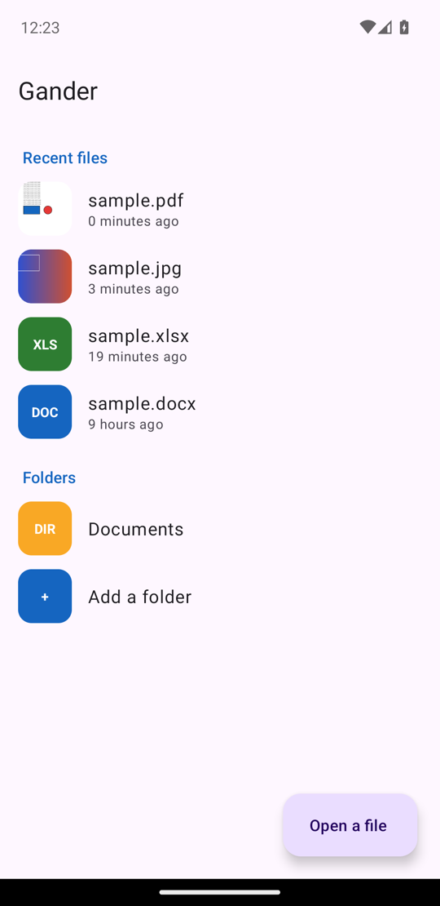
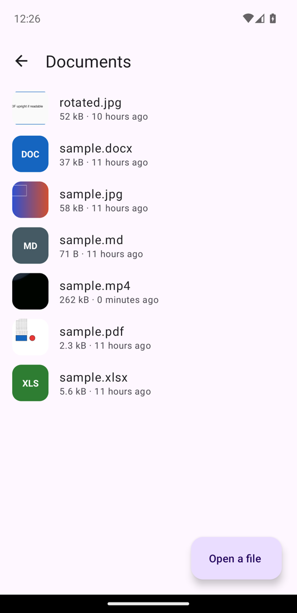
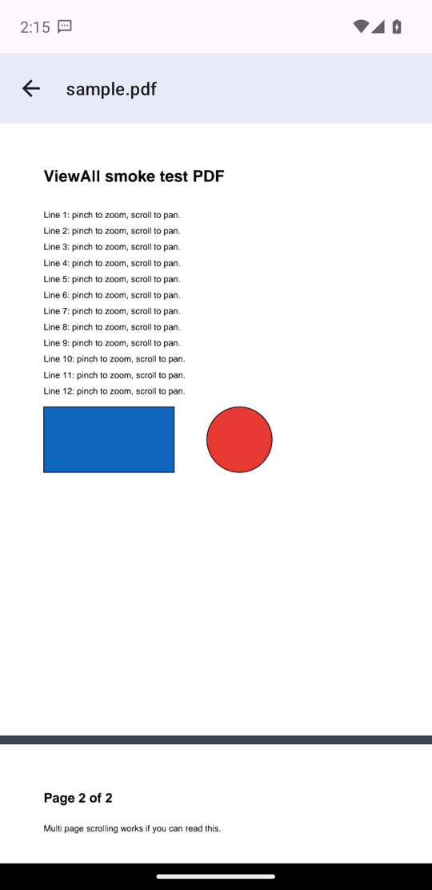
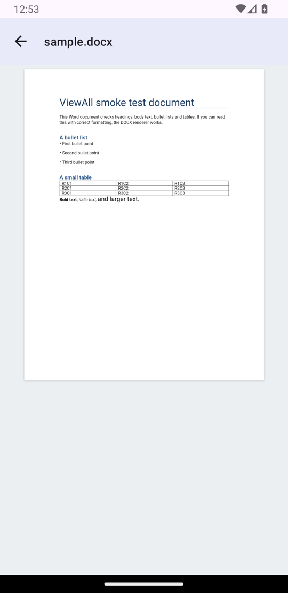
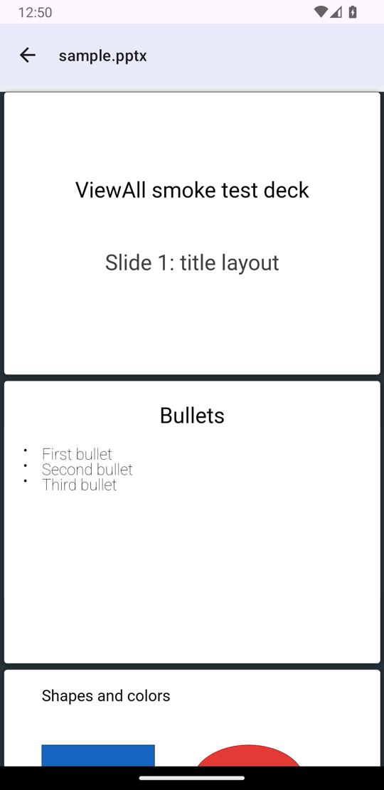
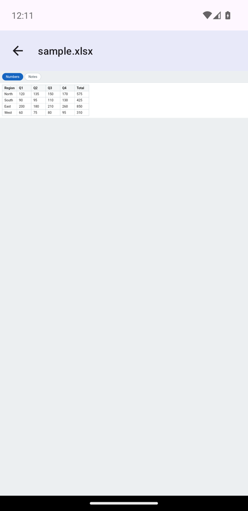

<p align="center">
  
</p>

# Gander 🪿

**Take a gander at any file.** A tiny, open source, fully offline **file viewer for Android** that opens
PDF, Word (`.docx`), Excel, PowerPoint (`.pptx`), photos, videos, audio, Markdown, text and code
in one app, with **zero permissions, no ads, no tracking and no internet access at all**.

[](LICENSE)
[](../../releases/latest)
[](../../actions)
-brightgreen)


Every phone ships with a dozen half-viewers that bounce your documents to cloud services.
Gander is the opposite: one small APK (about 8 MB) that renders everything **on the device**.
It cannot phone home because it does not even hold the INTERNET permission.

<p align="center">
  
</p>

## Screenshots

| Home: recents and folders | Folder browsing | PDF |
| :---: | :---: | :---: |
|  |  |  |

| Word (.docx) | PowerPoint (.pptx) | Excel (.xlsx) |
| :---: | :---: | :---: |
|  |  |  |

## Features

- **One viewer for everything**: documents, spreadsheets, slides, images, video, audio, Markdown, code
- **Pinch zoom and smooth scrolling** everywhere, with deep zoom into huge photos (tiled decoding)
- **Recent files** with thumbnail previews (image, video frame, PDF first page)
- **Folder browsing** through one-time system grants, still without any storage permission
- **Share sheet and "Open with" integration**: share a file from any app (chat, mail, browser) into Gander, or tap it in a file manager
- **Find in document**: search inside Word, Excel, slides, Markdown, text and code with match navigation
- **Share and locate**: send the open file to any app, or jump to its folder in the file manager
- **Private by construction**: no permissions, no INTERNET, no analytics, no accounts, nothing leaves the phone
- **Modern Android**: Material 3, dark mode, edge to edge, works on Android 8.0+

## Supported formats

| Category | Formats | Renderer |
| --- | --- | --- |
| Documents | PDF | pdf.js, offline in a sandboxed WebView |
| | Word `.docx` | docx-preview, offline in a sandboxed WebView |
| Spreadsheets | `.xlsx` `.xls` `.xlsm` `.xlsb` `.csv` `.ods` | SheetJS, offline |
| Slides | PowerPoint `.pptx` | PPTXjs, offline |
| Photos | JPG, PNG, WebP, BMP, HEIC/HEIF | Tiled deep-zoom image view, EXIF aware |
| | GIF (animated), SVG, AVIF, ICO | WebView |
| Video | MP4, M4V, MOV, MKV, WebM, 3GP, AVI, FLV, MPEG-TS | Media3 ExoPlayer |
| Audio | MP3, M4A, AAC, FLAC, WAV, OGG, Opus, AMR | Media3 ExoPlayer |
| Markdown | `.md` rendered as formatted HTML | marked + DOMPurify, offline |
| Text and code | `.txt` `.json` `.xml` logs, most source files | Text viewer |

Anything else, including files with no extension at all, offers **View as text**, which
shows the raw contents without renaming the file. Large files load 5 MB at a time with a
**Show more** button, so they open instantly and can still be read end to end.

Legacy binary `.doc` and `.ppt` are not supported (no faithful offline renderer exists);
the app explains this and suggests re-saving as `.docx` / `.pptx`. Binary `.xls` works.

## Install

Runs on **Android 8.0 (API 26) and up**.

Viewing PDFs also needs Android System WebView 125 or newer (May 2024). Any phone
still receiving WebView updates is well past that; if yours is not, Gander says so
when you open a PDF rather than failing quietly.

1. Download the latest APK from [Releases](../../releases/latest):
   `Gander-x.y.apk` runs on every architecture, since the app ships no native code.
2. Copy it to your phone, tap it, and allow "install unknown apps" when asked.
3. Optional: Play Protect may warn about an unknown developer; that is what
   sideloaded open source looks like. Tap "Install anyway".

Updating: install the new APK over the old one; recents and folder grants survive.

**Automatic updates without a store**: install
[Obtainium](https://github.com/ImranR98/Obtainium) and add
`https://github.com/mokshablr/gander` as an app source. It follows the tagged
GitHub releases here and updates Gander like a store would.

**Verify before installing**: every release is signed with the same key, so you can
confirm an APK really came from this repo. Obtainium can pin the fingerprint below,
and for a file you have already downloaded:

```sh
apksigner verify --print-certs Gander-x.y.apk
```

Signing certificate SHA-256:

```
5B:5C:F6:4A:94:23:7C:D5:F0:E0:85:76:00:38:BC:1C:EB:DF:18:DA:BA:5C:B3:EA:CA:7C:15:9F:22:A7:E2:4B
```

## How the zero-permission trick works

Gander receives files through the Storage Access Framework and "Open with" intents,
so the OS hands it exactly the documents you chose and nothing else. Office formats
render inside a locked-down WebView whose every request is intercepted by
`WebViewAssetLoader`: bundled JS libraries load from app assets and the document
streams from the content URI. No network stack is ever touched, and the app does
not declare the INTERNET permission, so there is nothing to audit or trust.

Folder browsing uses `ACTION_OPEN_DOCUMENT_TREE` grants. Note that Android itself
refuses to grant the Downloads root to any app; grant Documents, DCIM or a
subfolder of Downloads instead.

## Build from source

To build it yourself you need JDK 17+ and the Android SDK (platform 36). These are
build requirements only. The installed app runs on Android 8.0 (API 26) and up.

```sh
./gradlew assemblePublicDebug        # shared APK: no proprietary font assets
./gradlew assemblePublicRelease      # shared release APK
./gradlew assemblePersonalDebug      # private installable APK, separate package
./gradlew assemblePersonalRelease    # private release APK
```

### Public vs personal APK

`public` is the only flavor suitable for GitHub Releases or sharing. It uses only
open/default fallbacks and **must never contain proprietary font files**.

`personal` has the separate application ID `com.arjun.gander.personal` (plus
`.debug` for debug), so it can sit beside the shared edition. To use licensed
fonts on the owner's own device, create this local-only directory:

```text
app/src/personal/assets/viewer/private-fonts/
```

Put the owned `.ttf`, `.ttc`, `.otf`, or `.woff/.woff2` files there and create
`manifest.json` beside them using
[`docs/personal-font-pack.example.json`](docs/personal-font-pack.example.json).
The `family` must exactly match the font name recorded in the HWP/HWPX (for
example `HY견명조`). On opening an HWP/HWPX, Gander loads these faces before
rhwp calculates line widths. This directory is ignored by Git: do not commit
it, upload it, or distribute a personal APK containing its fonts.

Release signing expects a local, untracked keystore at `keystore/gander.jks`.
The store password and key password must be supplied at build time through the
`ganderStorePassword` / `ganderKeyPassword` Gradle properties or the
`GANDER_STORE_PASSWORD` / `GANDER_KEY_PASSWORD` environment variables. The
optional key alias defaults to `gander` and can be set with `ganderKeyAlias` or
`GANDER_KEY_ALIAS`.

For example, generate the keystore interactively so passwords do not appear in
shell history:

```sh
keytool -genkeypair -keystore keystore/gander.jks -alias gander \
  -keyalg RSA -keysize 2048 -validity 10000 -dname "CN=Gander"
```

Then provide the passwords only in the local build environment:

```sh
read -r -s GANDER_STORE_PASSWORD
export GANDER_STORE_PASSWORD
read -r -s GANDER_KEY_PASSWORD
export GANDER_KEY_PASSWORD
./gradlew assemblePublicRelease
```

If the keystore or either password is absent, release builds remain unsigned.
The keystore is gitignored on purpose: it is a personal signing key and must
never land in a public repo.

## Architecture in one paragraph

`ViewerActivity` routes by file extension first, MIME type second (`FileKind.kt`),
into one of three surfaces: a tiled `SubsamplingScaleImageView` for photos, Media3
ExoPlayer for video and audio, or a sandboxed WebView for everything rendered by
vendored JS libraries (`app/src/main/assets/viewer/`), PDF included. Documents
under 16 MB are handed to the WebView whole; larger ones are served in ranges so
only the pages being read are held in memory. The home screen (`MainActivity`) lists recents
(persisted SAF grants) and granted folders (DocumentsContract child queries), with
thumbnails generated off-thread and cached (`Thumbs.kt`).

Vendored viewer libraries and their licenses: pdf.js (Apache-2.0), JSZip (MIT),
docx-preview (Apache-2.0), SheetJS CE (Apache-2.0), PPTXjs + divs2slides (MIT),
jQuery 1.11 (MIT), D3 3.x + NVD3 (BSD/Apache), marked (MIT), DOMPurify
(Apache-2.0/MPL). The app ships no native code.

## Roadmap

- F-Droid listing
- Legacy `.doc` / `.ppt` support if a usable offline renderer appears
- iOS companion (thin QuickLook wrapper)

## Contributing

Issues and small PRs are welcome, see [CONTRIBUTING.md](CONTRIBUTING.md).
If Gander is useful to you, a star helps other people find it.

## License

[MIT](LICENSE). Vendored viewer libraries keep their own licenses, listed above;
all are MIT/Apache/BSD and compatible.
